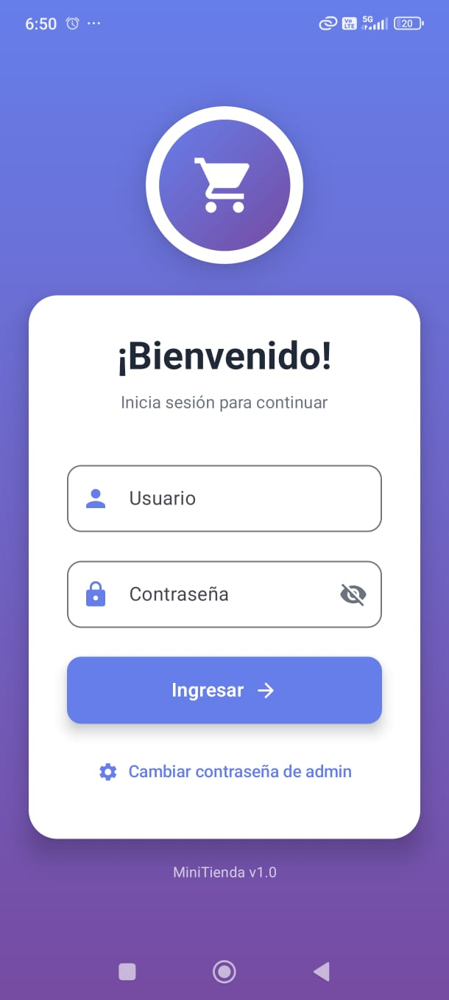
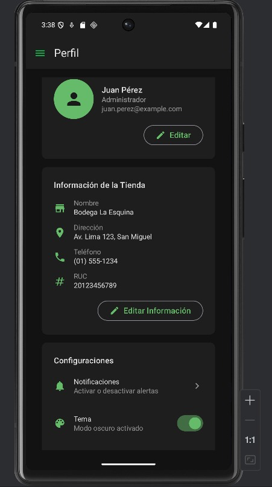
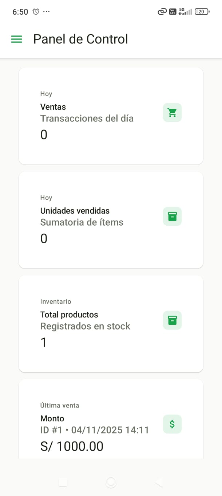
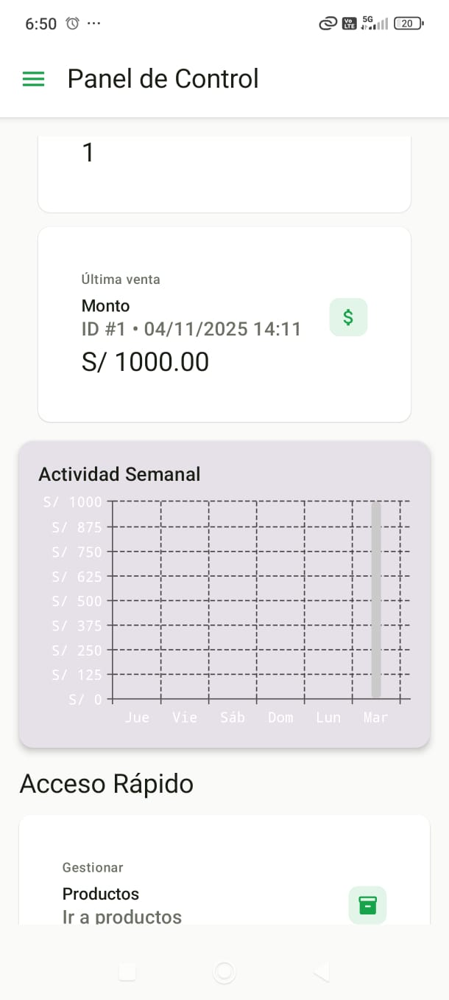
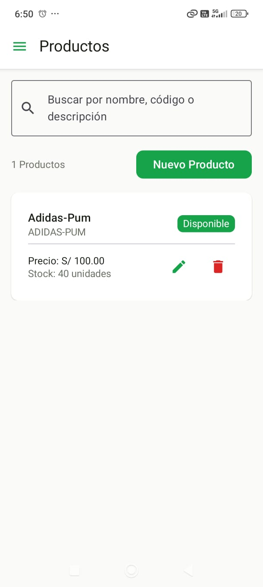
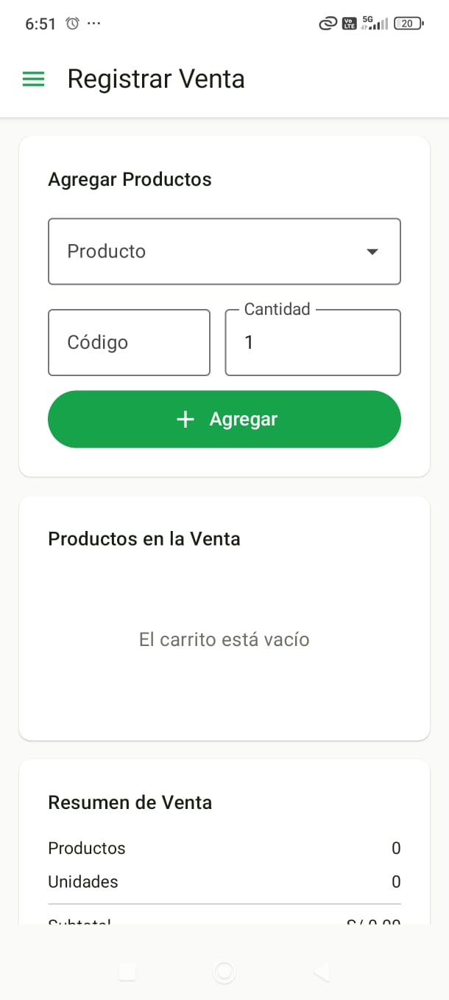
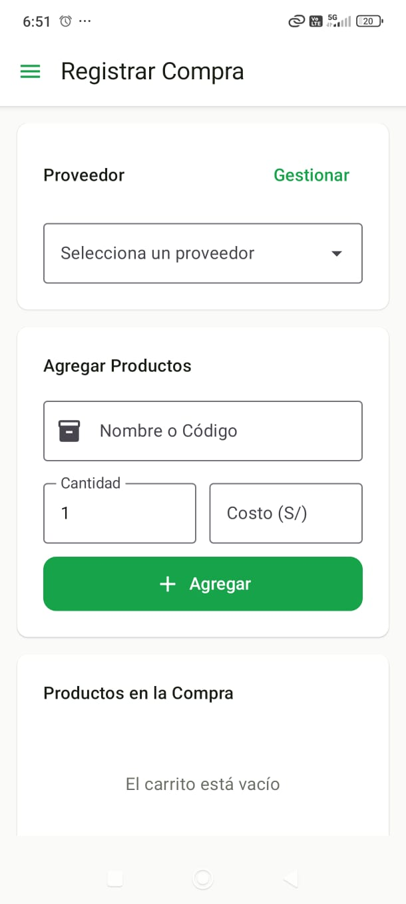
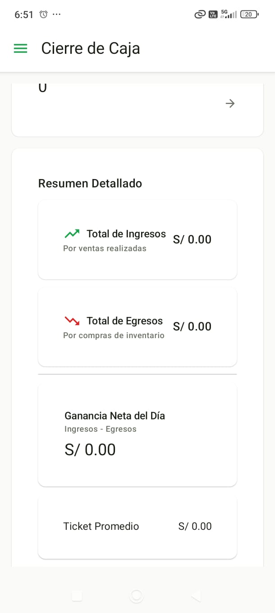
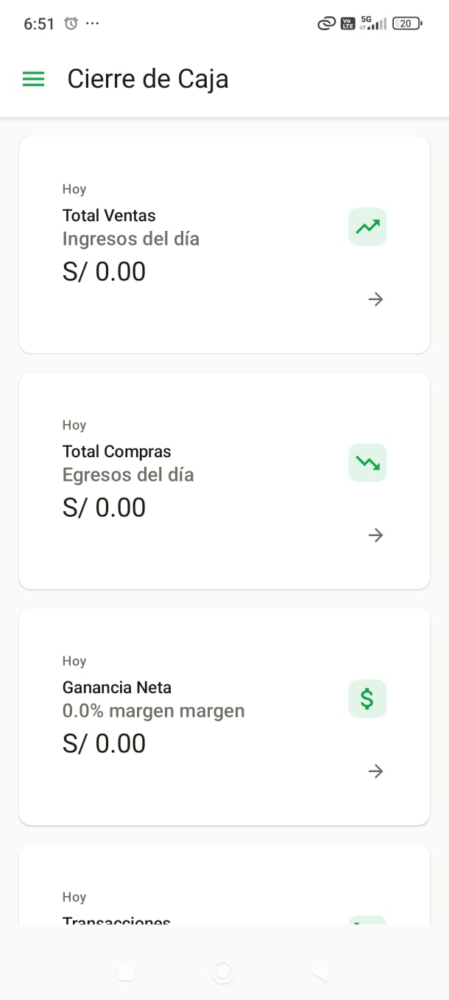

# 🏪 Proyecto "Bodequita"

Aplicación móvil desarrollada en **Android Studio con Kotlin y Jetpack Compose**, que permite la **gestión de ventas, compras, productos, proveedores y cierre de caja** de una tienda local.  
Usa **Room** como base de datos local y arquitectura **MVVM** para un código limpio, escalable y fácil de mantener.

---

## 👥 Integrantes del Proyecto

| Rol                             | Nombre | Responsabilidades |
|---------------------------------|---------|------------------|
| 👨‍💻 Desarrollador Y Diseñador | **David Carhuaz** | Implementación de la lógica de la aplicación (Room, ViewModels, Navegación), diseño de interfaces con Jetpack Compose y estructuración del proyecto. |
| 👨‍🎨 Desarrollador y Diseñador | **Betuel Arones** | Desarrollo de la lógica de negocio y del flujo de datos, apoyo en el diseño visual y disposición de pantallas, pruebas de funcionalidad y mejoras de interfaz. |

---

### 💪 Trabajo en Equipo
Ambos integrantes participaron de forma colaborativa en:
- El diseño de la arquitectura **MVVM**.
- La creación de los **módulos principales**: productos, ventas, compras, proveedores y cierre de caja.
- La construcción de las pantallas y la integración del **Material Design 3**.
- Las pruebas de funcionalidad y corrección de errores.  

## 📸 Capturas de Pantalla

### 🔐 Pantalla de Inicio de Sesión

---

### 👤 Pantalla de Perfil de Usuario

---

### 🏠 Panel Principal y Acceso Rápido
| Panel | Panel Medio | Acceso Rápido |
|---|-------------|---|
|  |  |  |

---

### 🛍️ Módulo de Productos

---

### ➕ Nuevo Producto

---

### 💸 Módulo de Ventas

---

### 🧾 Registro de Compra de Producto

---

### 💰 Cierre de Caja
| Cierre Caja (parte superior) | Cierre Caja (detalle inferior) |
|---|---|
|  |  |

## ⚙️ Funcionalidades Principales

### 🛍️ Módulo de Productos
- Registrar, editar y eliminar productos.
- Asignar categorías a cada producto.
- Mostrar el stock disponible y el precio actual.
- Buscador de productos por nombre o categoría.

### 📦 Módulo de Compras
- Registrar compras a proveedores.
- Agregar múltiples productos en una misma compra.
- Calcular automáticamente el costo total.
- Actualizar el stock de los productos comprados.

### 💰 Módulo de Ventas
- Registrar ventas con múltiples productos.
- Calcular subtotal, impuestos y total a pagar.
- Controlar existencias al realizar una venta.
- Visualizar el historial de ventas con fecha y hora.

### 🧾 Cierre de Caja
- Mostrar resumen diario de ventas y compras.
- Calcular ingresos, egresos y utilidad neta.
- Registrar el monto final del día (caja).

### 🧑‍🤝‍🧑 Módulo de Proveedores
- Registrar y mantener información de proveedores.
- Vincular proveedores con las compras realizadas.

### 📊 Dashboard
- Visualizar estadísticas resumidas de la tienda.
- Mostrar totales de ventas, compras y productos activos.
- Acceso rápido a los principales módulos.

Figma enlace:https://www.figma.com/make/Y0aj8kQGkgpPme7HMFErKy/Store-Management-Application?fullscreen=1

